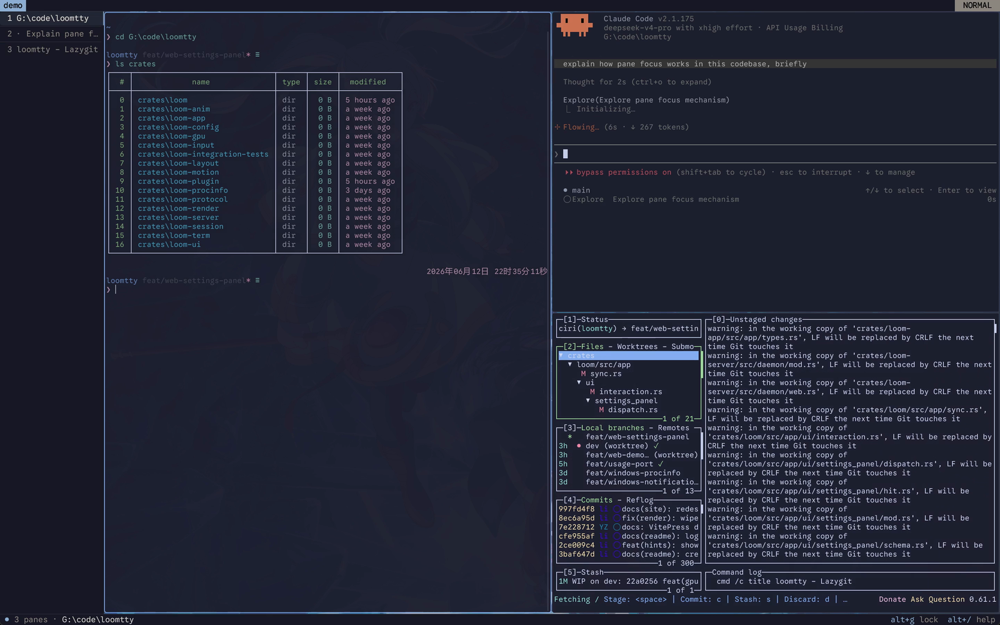
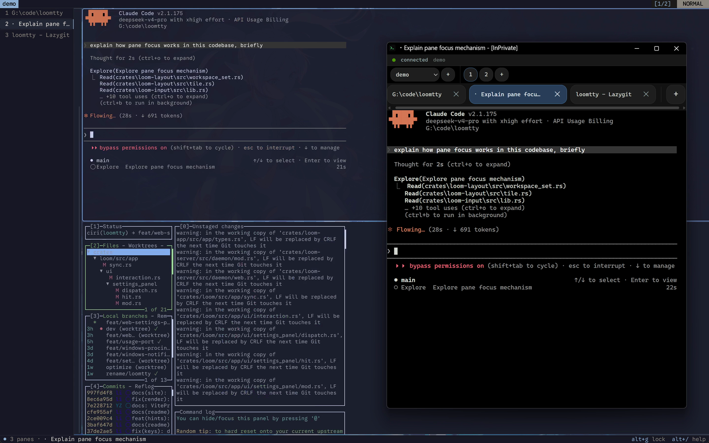

<p align="center">
  
</p>

# loomtty

A GPU-accelerated terminal multiplexer written in Rust. Column-based layouts and
workspaces, a built-in browser client, and remote attach over a binary protocol.

[](https://github.com/l1nxy/loomtty/actions/workflows/ci.yml)
[](LICENSE)


> **🚧 Early and experimental (v0.1).** Expect rough edges — not everything is
> guaranteed to work yet. Primarily developed on Linux and Windows; **macOS is
> untested, treat it as work in progress.**

https://github.com/user-attachments/assets/6b078921-1065-4867-a412-e2f9c949fb9a

<p align="center">
  <sub>
    One 54-second take, no cuts — columns &amp; tiles, lazygit and Claude Code in
    panes, the overview, then the same session attached from a browser.
    More at <a href="https://linxy.dev/loomtty/">linxy.dev/loomtty</a>.
  </sub>
</p>

| Columns &amp; stacked tiles | The same session, from a browser |
| :---: | :---: |
|  |  |

## Features

- **Column + workspace layout** — tmux/zellij-style multiplexing, organized in columns.
- **GPU rendering** — Vulkan / Metal / OpenGL / DirectX 11, with ligatures and inline images (Kitty/Sixel).
- **Remote attach** — connect to a session on another host over a binary protocol + SSH tunnel.
- **Browser client** — `loomtty web` serves the same session as an installable PWA.
- **Predictive echo** — mosh-style local echo over high-latency links.
- **Agent-aware sessions** — auto-restores agent panes (Claude Code, Codex, opencode, Droid) on reattach.
- **Lua plugins** — sandboxed scripting with an event API.

## Install

See [INSTALL.md](INSTALL.md) for platform builds and shell integration. From source:

```bash
cargo build --release
# → target/release/loomtty (client) and target/release/loomtty-server (daemon)
```

## Quick Start

```bash
loomtty                  # attach to the last session, or create one
loomtty my-project       # attach to / create a named session
loomtty ls               # list sessions
loomtty a my-project     # attach to an existing session
loomtty kill my-project  # kill a session
```

Run `loomtty init` for an interactive config wizard.

## Keybindings

**Leader:** `Alt` (configurable). loomtty defaults to sticky / zellij-style
input, so you hold `Alt` and press the key — e.g. `Alt n` opens a new column.
Set `[input] mode = "prefix"` for tmux-style tap-leader-then-key.

| Keys | Action |
|------|--------|
| `Alt h` `j` `k` `l` | Focus pane left / down / up / right |
| `Alt n` | New column |
| `Alt d` | Split down (new row) |
| `Alt x` | Close pane |
| `Alt f` | Full-width column |
| `Alt r` | Resize mode |
| `Alt s` / `Alt m` | Scroll / move mode |
| `Alt b` | Broadcast input to all panes |
| `Alt o` | Overview |
| `Alt p` | Command palette |
| `Alt q` | Detach |
| `Alt /` | Keybindings help |

Direct (no leader): `Ctrl+Shift+F` search · `Ctrl+Shift+C` copy ·
`Ctrl+Shift+V` paste (`Cmd` instead of `Ctrl+Shift` on macOS).

## Configuration

Config lives at `~/.config/loom/config.toml`. A minimal example:

```toml
[font]
family = "JetBrains Mono"
size = 12.0

[theme]
preset = "loom_dark"   # one_dark, catppuccin_mocha, tokyo_night, dracula, nord, gruvbox_dark, ghostty, …

[keys]
leader = "alt"

[input]
mode = "sticky"        # "sticky" (zellij-style) or "prefix" (tmux-style)
```

Every option, default, and valid range is documented in
[`crates/loom-config/src/schema.rs`](crates/loom-config/src/schema.rs). You can
also edit settings live from the in-app settings panel.

## Shell Integration

Sourcing the snippet for your shell enables OSC 133 prompt marks — jump-to-prompt
in scroll mode, command status, and exit codes. The scripts live in
[`crates/loom-server/shell-integration/`](crates/loom-server/shell-integration/)
(`loom.bash`, `loom.zsh`, `loom.fish`, `loom.ps1`); see [INSTALL.md](INSTALL.md) for setup.

## Web UI

`loomtty web` turns the multiplexer into a browser terminal: an HTTP SPA plus a
token-authenticated WebSocket gateway, installable as a PWA. The gateway speaks
plain `http`/`ws` — put TLS in front (reverse proxy or tunnel) before exposing it
past loopback. See [`web/README.md`](web/README.md).

## Contributing

[AGENTS.md](AGENTS.md) is the build / architecture / data-flow guide for
contributors and coding agents.

## Acknowledgments

loomtty borrows ideas from work it admires:

- [niri](https://github.com/YaLTeR/niri) — scrollable column layout
- [tmux](https://github.com/tmux/tmux) — the detach/attach multiplexer model
- [zellij](https://zellij.dev) — sticky input modes and a browser client
- [Windows Terminal](https://github.com/microsoft/terminal) — native Windows + GPU rendering
- [Ghostty](https://ghostty.org) — GPU-accelerated terminal craft
- [mosh](https://mosh.org) — predictive echo over high-latency links

## License

[AGPL-3.0-only](LICENSE) © loomtty contributors.
